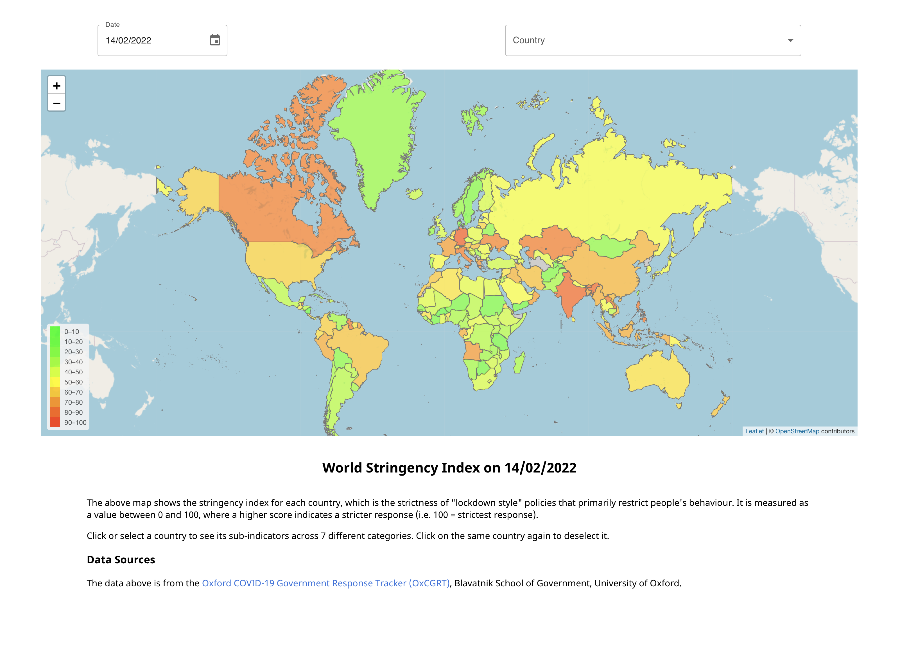
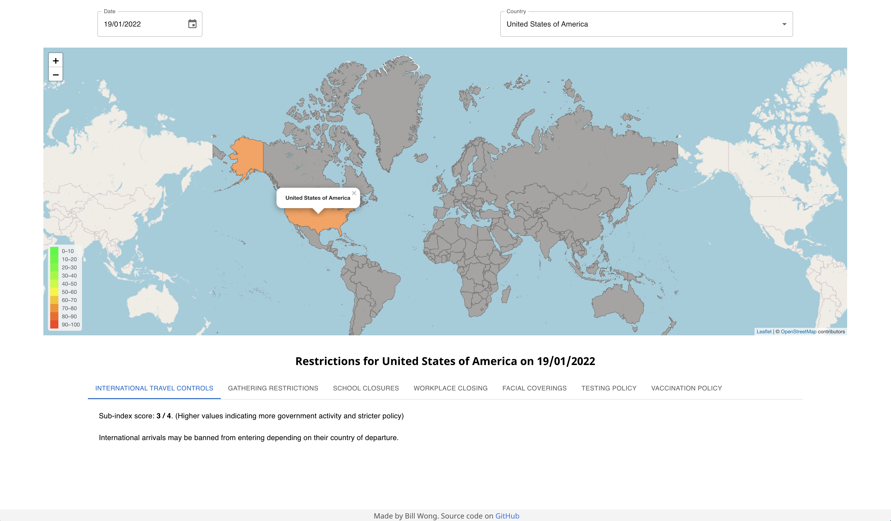

# **World Covid Restrictions Map** - [_Link here_](https://policy-map.web.app)

> ### This project is the final product of one of my bootcamps after some _small_ modifications.

#### This project was inspired by the gradual reopening of countries around the world, as we move through the pandemic. Different countries have different sets of restrictions, and it is often hard to keep track of changing restrictions for each country easily.

#### The website uses an interactive map and GUI to help users gather relevant information about overall restrictions for all countries along with specific rules such as international travel controls for each country.

#### Tools used: _React.js, Material UI, React-Leaflet, AWS Gateway, AWS Lambda, AWS DynamoDB_

> #### Here are some of my responsibilities during the bootcamp:  
>
> - #### Led the front-end team: delegated tasks, initiated discussions, reviewed code, merged all files, helped team members debug and test code.
> - #### Implemented the entire interactive map component: clickable countries, country outlines and popups with Leaflet and GeoJSON, dynamic color scheme and legend reflective of the restriction levels.
> - #### Connected the frontend to the backend AWS API Gateway with asynchronous POST requests.
> - #### Processed the JSON data from the backend and integrated it into the map and information tabs with React States and Hooks.
> - #### Worked closely with the UI/UX design group to design the general website layout which is most feasible to implement.

 

#### The data in the website is from the [Oxford COVID-19 Government Response Tracker (OxCGRT)](https://github.com/OxCGRT/covid-policy-tracker), Blavatnik School of Government, University of Oxford.   

### **Desktop Preview**:

 

 

### This project was bootstrapped with [Create React App](https://github.com/facebook/create-react-app).

> ### In the project directory, you can run:
>
> - #### `npm install`
> - #### `npm start`
> - #### `npm test`
> - #### `npm run build`
